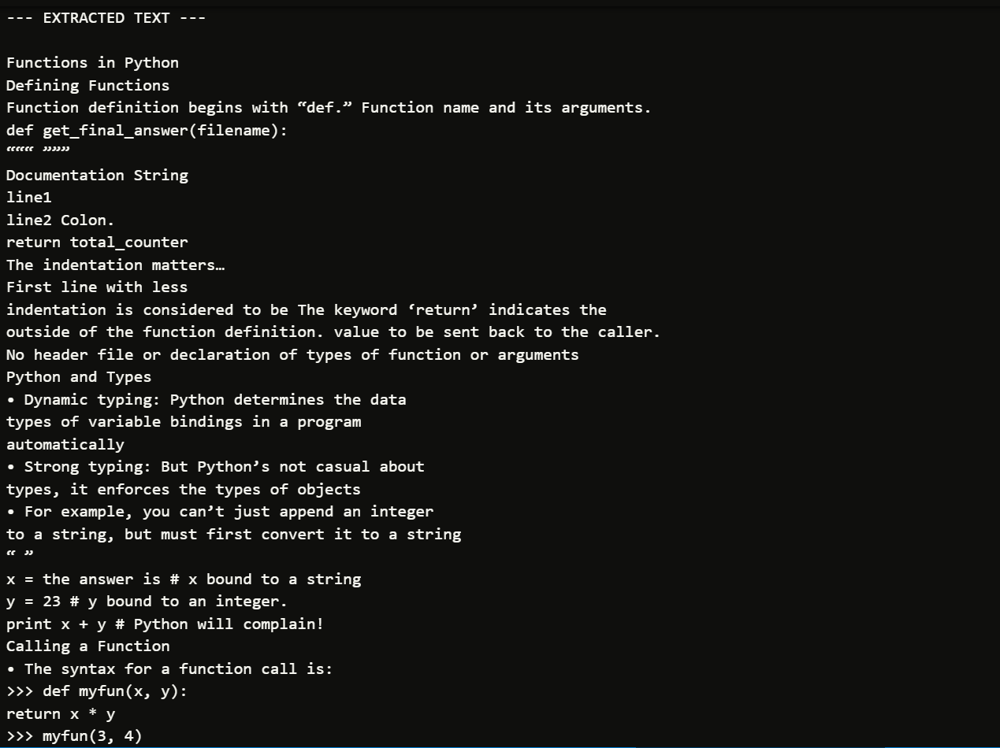
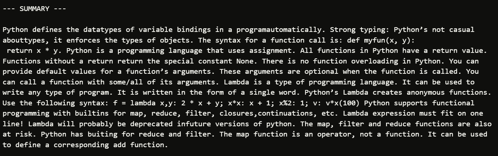
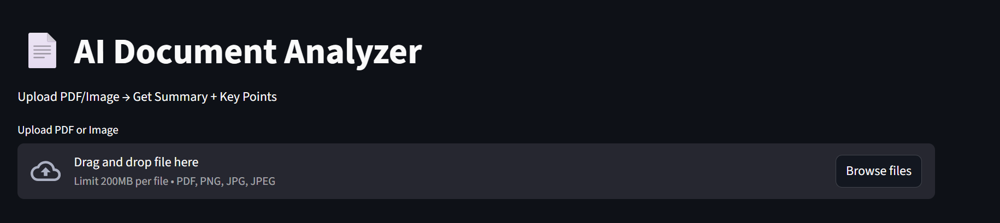
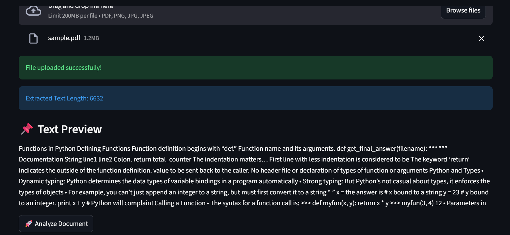
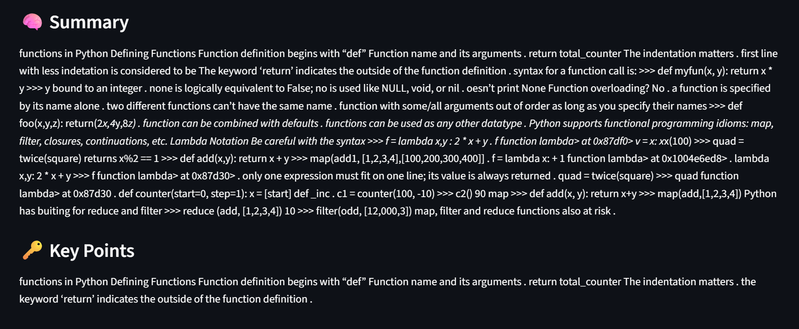

# 📄 Document Summarizer (PDF Or Image → Text → Summary)

---

## Manually uploaded file

## 🚀 Overview

This project is a **Document AI pipeline** that reads input files (PDFs or images), extracts text, and generates a concise summary using Natural Language Processing.

It supports:

* 📄 Text-based PDFs
* 📷 Scanned PDFs
* 🖼️ Images (JPG, PNG)

---

## 🎯 Why This Project Was Built

Real-world documents exist in different formats:

* Some PDFs contain text → easy to extract
* Some PDFs are scanned → no text inside
* Images contain only pixels

👉 A robust system must handle **all cases automatically**

This project was built to:

* Extract text from **any document type**
* Handle **real-world messy inputs**
* Convert large text into **meaningful summaries**

---

## 🧠 System Workflow

```text
Input File
   ↓
File Type Detection
   ↓
Text Extraction
   ↓
Text Chunking
   ↓
Summarization
   ↓
Output
```

---

## 🧱 Libraries Used & Why

### 1️⃣ `pdfplumber`

👉 Used for:

* Extracting text from **text-based PDFs**

👉 Why used:

* Fast and accurate
* Direct extraction avoids unnecessary OCR

---

### 2️⃣ `pdf2image`

👉 Used for:

* Converting scanned PDFs → images

👉 Why used:

* Scanned PDFs do not contain text
* Must convert into images before applying OCR

---

### 3️⃣ `PaddleOCR`

👉 Used for:

* Extracting text from images

👉 Why used:

* Works well with:
  * scanned documents
  * rotated text
  * low-quality images

---

### 4️⃣ `transformers`

👉 Used for:

* NLP-based summarization

👉 Why used:

* Converts large unstructured text → meaningful summary

---

## ⚙️ Code Explanation (Function by Function)

---

### 🔹 OCR Initialization

```python
ocr = PaddleOCR(use_angle_cls=True, lang='en')
```

👉 Why:

* Loads OCR model once
* `use_angle_cls=True` → detects rotated text

---

### 🔹 Summarizer Initialization

```python
summarizer = pipeline("summarization", model="facebook/bart-large-cnn")
```

👉 Why:

* Pre-trained NLP model
* Handles long text summarization

---

### 🔹 `extract_text_from_image()`

👉 Purpose:
Convert image → text

```python
result = ocr.ocr(image_path)
```

👉 Runs OCR model

```python
text += word[1][0]
```

👉 Extracts actual text from OCR output structure

---

### 🔹 `extract_text_from_pdf()`

👉 Purpose:
Handle both types of PDFs

#### Step 1: Try direct extraction

```python
pdfplumber.open(pdf_path)
```

👉 Fast and accurate for text PDFs

---

#### Step 2: Fallback (scanned PDF)

```python
if len(text.strip()) == 0:
```

👉 If no text found → assume scanned

---

```python
convert_from_path(pdf_path)
```

👉 Converts PDF → images

---

```python
extract_text_from_image()
```

👉 Applies OCR

---

👉 This creates a **robust fallback mechanism**

---

### 🔹 `chunk_text()`

```python
return [text[i:i+size] for i in range(0, len(text), size)]
```

👉 Why needed:

* NLP models have **input size limits**
* Large documents must be split

---

### 🔹 `summarize_text()`

```python
result = summarizer(chunk)
```

👉 Processes each chunk

---

```python
" ".join(summaries)
```

👉 Combines all summaries into final output

---

## 🚀 Main Execution Logic

```python
if __name__ == "__main__":
```

👉 Entry point of script

---

### File type detection

```python
if file_path.endswith(".pdf"):
```

👉 Determines processing path

---

### Processing flow

```text
PDF → extract_text_from_pdf()
Image → extract_text_from_image()
```

---

### Output

```python
print(text[:1000])
print(summary)
```

👉 Shows:

* extracted text preview
* final summary

---

## 📊 Features

* Automatic file type detection
* Handles scanned + text PDFs
* Supports image inputs
* Chunk-based summarization
* End-to-end pipeline

---

## ⚠️ Limitations

* Heavy model → slower execution
* Summary quality depends on model
* No UI (command-line only)

---

## 🎯 Use Cases

* Document summarization
* Academic notes processing
* Invoice / receipt reading
* Text extraction from images

---

## 🧠 Key Concepts Demonstrated

* OCR (Optical Character Recognition)
* NLP (Natural Language Processing)
* Data pipeline design
* Handling real-world document formats

---

## 🚀 Future Improvements

* Add UI (Streamlit or web app)
* Replace model with advanced LLM
* Add question-answer system
* Improve performance

---

---

# 🌐 AI Document Analyzer (Streamlit App)-->main_app.py

---

# 🚀 Overview

This project is a **user-facing Document AI application** built using Streamlit.

It allows users to:

* Upload PDF or Image
* Extract text automatically
* Generate:
  * 🧠 Summary
  * 🔑 Key Points

---

# 🎯 Why This File Was Built

Earlier version (`main.py`) was:

❌ CLI-based (only developer can use)
❌ Not user-friendly

This file was built to:

✅ Make system usable for **any user**
✅ Provide **UI (Upload → Analyze → Result)**
✅ Convert backend logic into **product**

---

# 🧱 Libraries Used & Why

---

## 1️⃣ `streamlit`

👉 Purpose:

* Build UI without frontend coding

👉 Why used:

* Fast development
* Interactive interface
* Ideal for ML apps

---

## 2️⃣ `pdfplumber`

👉 Purpose:

* Extract text from text-based PDFs

👉 Why:

* Direct extraction is faster than OCR

---

## 3️⃣ `pdf2image`

👉 Purpose:

* Convert scanned PDFs → images

👉 Why:

* Scanned PDFs don’t contain text

---

## 4️⃣ `PaddleOCR`

👉 Purpose:

* Extract text from images

👉 Why:

* Handles real-world messy documents

---

## 5️⃣ `transformers`

👉 Purpose:

* NLP summarization

👉 Why:

* Converts large text → meaningful summary

---

## 6️⃣ `PIL (Pillow)`

👉 Purpose:

* Handle image uploads

---

## 7️⃣ `tempfile`

👉 Purpose:

* Store temporary images for OCR

---

# 🧠 Code Explanation (Line-by-Line Logic)

---

# 🔹 UI Setup

```python
st.set_page_config(page_title="Document Analyzer", layout="wide")
```

👉 Why:

* Configures UI layout

---

```python
st.title("📄 AI Document Analyzer")
st.write("Upload PDF/Image → Get Summary + Key Points")
```

👉 Why:

* Gives user context
* Defines purpose of app

---

# 🔹 Model Initialization

```python
@st.cache_resource
```

👉 VERY IMPORTANT

👉 Why:

* Prevents model reloading every time
* Improves performance

---

```python
def load_ocr():
    return PaddleOCR(use_angle_cls=True, lang='en')
```

👉 Why:

* Initialize OCR once
* `use_angle_cls=True` → detects rotated text

---

```python
def load_summarizer():
```

👉 Why:

* Separate model loading for modularity

---

```python
model_name = "t5-small"
```

👉 Why:

* Lightweight model
* Avoids heavy memory issues

---

```python
AutoTokenizer.from_pretrained(model_name)
AutoModelForSeq2SeqLM.from_pretrained(model_name)
```

👉 Why:

* Load tokenizer → converts text → tokens
* Load model → processes tokens

---

```python
pipeline("summarization", model=model, tokenizer=tokenizer)
```

👉 Why:

* Creates easy-to-use summarization interface

---

```python
ocr = load_ocr()
summarizer = load_summarizer()
```

👉 Why:

* Store models globally (reuse)

---

# 🔹 OCR Function

```python
def extract_text_from_image(image_path):
```

👉 Purpose:

* Convert image → text

---

```python
result = ocr.ocr(image_path)
```

👉 Runs OCR model

---

```python
if result:
```

👉 Why:

* Prevents crash if OCR fails

---

```python
text += word[1][0]
```

👉 Extracts actual text from OCR structure

---

# 🔹 PDF Function

```python
def extract_text_from_pdf(file_bytes):
```

👉 Why:

* Streamlit provides file as bytes (not path)

---

```python
with pdfplumber.open(file_bytes)
```

👉 Try direct extraction

---

```python
if page_text:
```

👉 Avoids empty values

---

```python
except:
    pass
```

👉 Why:

* Prevent crash if PDF fails

---

### Fallback (Important)

```python
if len(text.strip()) == 0:
```

👉 Detect scanned PDF

---

```python
convert_from_bytes(file_bytes.read())
```

👉 Convert PDF → images

---

```python
extract_text_from_image(tmp.name)
```

👉 Apply OCR

---

👉 This creates **robust pipeline**

---

# 🔹 Text Cleaning

```python
def clean_text(text):
```

---

```python
text.replace("\n", " ")
```

👉 Remove line breaks

---

```python
" ".join(text.split())
```

👉 Remove extra spaces

---

👉 Why:

* OCR output is messy
* Improves summarization

---

# 🔹 Chunking

```python
def chunk_text(text, size=800):
```

👉 Why:

* Models cannot process large text

---

# 🔹 Summarization

```python
def summarize_text(text):
```

---

```python
chunks = chunk_text(text)
```

👉 Split text

---

```python
try:
    result = summarizer(...)
```

👉 Why:

* Prevent crash on bad chunks

---

```python
return " ".join(summaries)
```

👉 Combine outputs

---

# 🔹 Key Points Extraction

```python
prompt = "summarize key points: " + text[:1500]
```

👉 Trick:

* Same model used differently
* Changes output style

---

# 🔹 File Upload UI

```python
uploaded_file = st.file_uploader(...)
```

👉 Allows user to upload file

---

# 🔹 File Processing

```python
if uploaded_file:
```

👉 Trigger after upload

---

```python
if uploaded_file.type == "application/pdf":
```

👉 Detect file type

---

```python
Image.open(uploaded_file)
```

👉 Load image file

---

```python
tempfile.NamedTemporaryFile
```

👉 Why:

* OCR needs file path

---

# 🔹 Debug Info

```python
st.info(f"Extracted Text Length: {len(text)}")
```

👉 Helps debugging

---

# 🔹 Error Handling

```python
if len(text) == 0:
```

👉 Handles OCR failure

---

# 🔹 Output UI

```python
st.write(text[:1000])
```

👉 Show preview

---

```python
if st.button("Analyze Document"):
```

👉 User-controlled execution

---

```python
with st.spinner("Analyzing...")
```

👉 UX improvement

---

```python
st.write(summary)
st.write(key_points)
```

👉 Final output

---

# 🧩 Complete Flow

```text
User uploads file
        ↓
File type detected
        ↓
Text extracted (OCR if needed)
        ↓
Text cleaned
        ↓
Chunking
        ↓
Summarization
        ↓
Displayed in UI
```

---

---

# ⚠️ Limitations

* Summary quality limited (t5-small)
* No deep understanding
* No Q&A

---

---

# 💡 Final Insight

This project demonstrates:

* OCR + NLP integration
* Handling real-world documents
* Building user-facing AI systems







---
